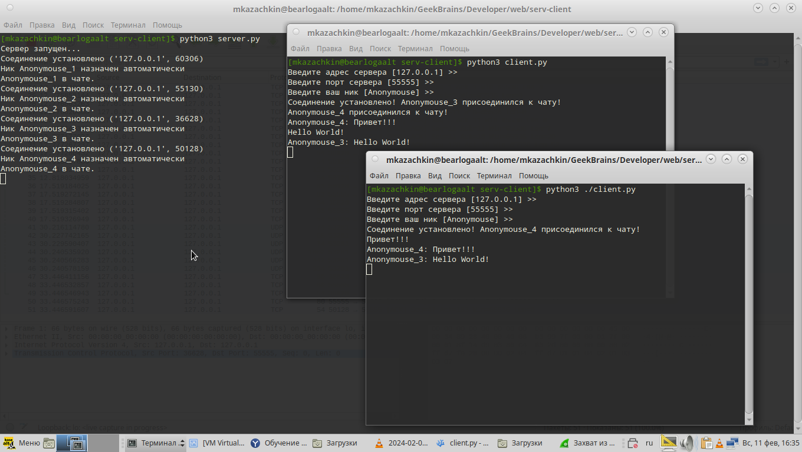
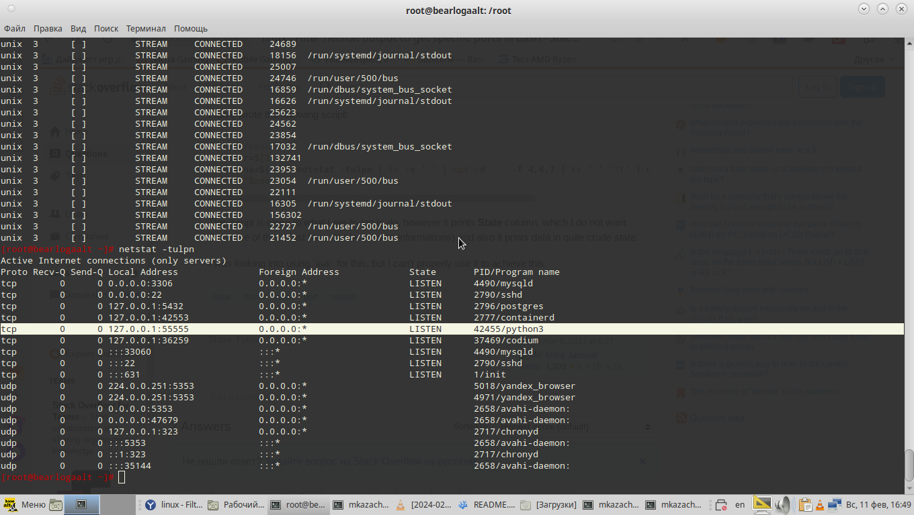
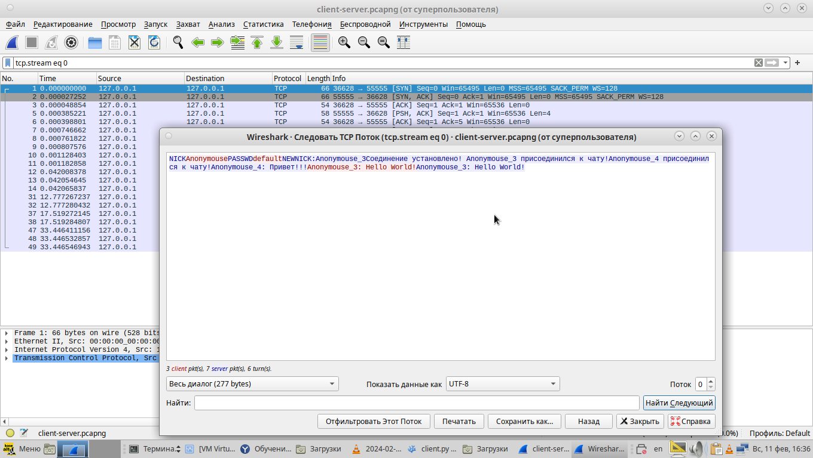

# Простейший чат. Улучшенный и дополненный
## Задача 1.
Что сделано:
* Закрепление ника за пользователем по паролю при первом логине
* Анонимный логин
* Выход из чата по команде exit

## Задача 2.

Имитация чата на локальной машине.

## Задача 3.
Этот код размещен на github

## Задача 4.

netstat

## Задача 5.

Перехват траффика чата при помощи Wireshark
